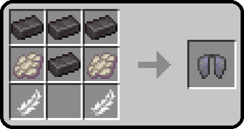

# 2BN Minecraft Custom Crafting

## [Back to Blocks](back-to-blocks/)

Original inspiration taken from [Vanilla Tweaks: Crafting Tweaks](https://vanillatweaks.net/picker/crafting-tweaks), and enhanced to include more reverse crafting recipes.

Instead of just allowing reverse crafting from stairs and slabs, we offer reverse crafting for all types of:

| | | | |
| :---: | :---: | :---: | :---: |
| [boats](https://minecraft.wiki/w/Boat) | [buttons](https://minecraft.wiki/w/Button) | [chest boats](https://minecraft.wiki/w/Boat_with_Chest) | [doors](https://minecraft.wiki/w/Door) |
| [fence gates](https://minecraft.wiki/w/Fence_Gate) | [fences](https://minecraft.wiki/w/Fence) | [hanging signs](https://minecraft.wiki/w/Hanging_Sign) | [pressure plates](https://minecraft.wiki/w/Pressure_Plate) |
| [quartz](https://minecraft.wiki/w/Block_of_Quartz) | [signs](https://minecraft.wiki/w/Sign) | [slabs](https://minecraft.wiki/w/Slab) | [stairs](https://minecraft.wiki/w/Stairs) |
| [trapdoors](https://minecraft.wiki/w/Trapdoor) | | | |

### Download

| Version | Download (.zip) |
| --- | --- |
| 1.21.4 | [Download](back-to-blocks/1.21.4/2bn-back-to-blocks/2bn-back-to-blocks_1.21.4.zip) |
| 1.21.0 | [Download](back-to-blocks/1.21.0/2bn-back-to-blocks/2bn-back-to-blocks.zip) |
| 1.20.4 | [Download](back-to-blocks/1.20.4/2bn-reverse-crafting-VTmodified/2bn-reverse-crafting-VTmodified.zip) |

---

## [Craftable Dyes](craftable-dyes/)

Sometimes [dyes](https://minecraft.wiki/w/Dye) can be tough to obtain, or take forever to smelt. We've added a solution to allow easier access to the following dyes:

| Dye | Recipe | How |
| --- | --- | --- |
| black | coal / charcoal | crafting table |
| green | kelp | crafting table |

### Download

| Version | Download (.zip) |
| --- | --- |
| 1.21.4 | [Download](craftable-dyes/1.21.4/2bn-craftable-dyes/2bn-craftable-dyes_1.21.4.zip) |

---

## [Craftable Elytra](craftable-elytra/)

Some players are terrified of visiting the End dimension, and therefore have to pay other players to obtain [Elytra](https://minecraft.wiki/w/Elytra) or Shulker Boxes for them. It might take a bit longer and be rather expensive, but some may consider it far better than going to the End. Plus, for hardcore players, this means potentially having wings before defeating the dragon, Jane!

### Download

| Version | Download (.zip) |
| --- | --- |
| 1.21.0 | [Download](craftable-elytra/1.21.0/2bn-craftable-elytra/2bn-craftable-elytra.zip) |
| 1.20.4 | [Download](craftable-elytra/1.20.4/2bn-craftable-elytra/2bn-craftable-elytra.zip) |

---

