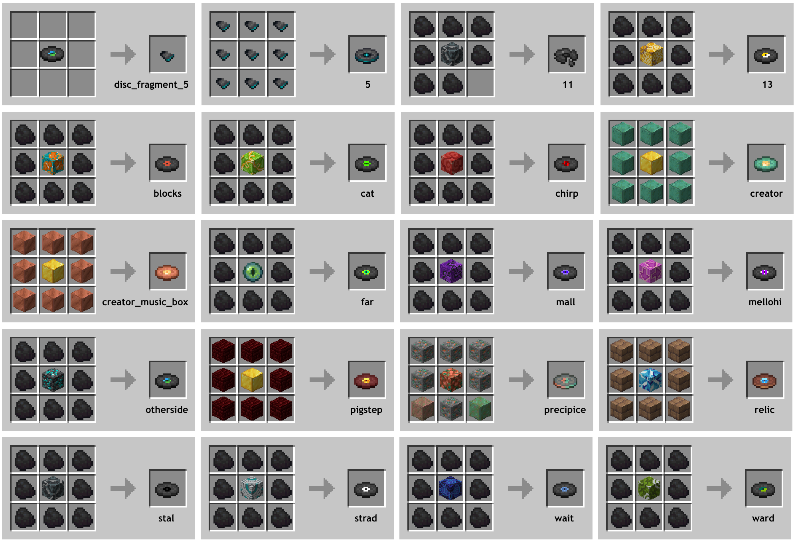
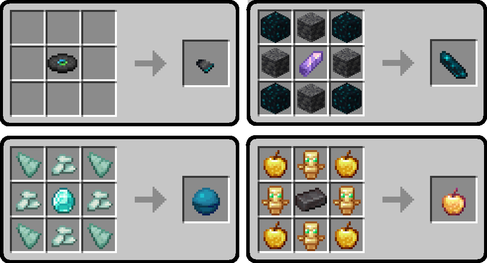
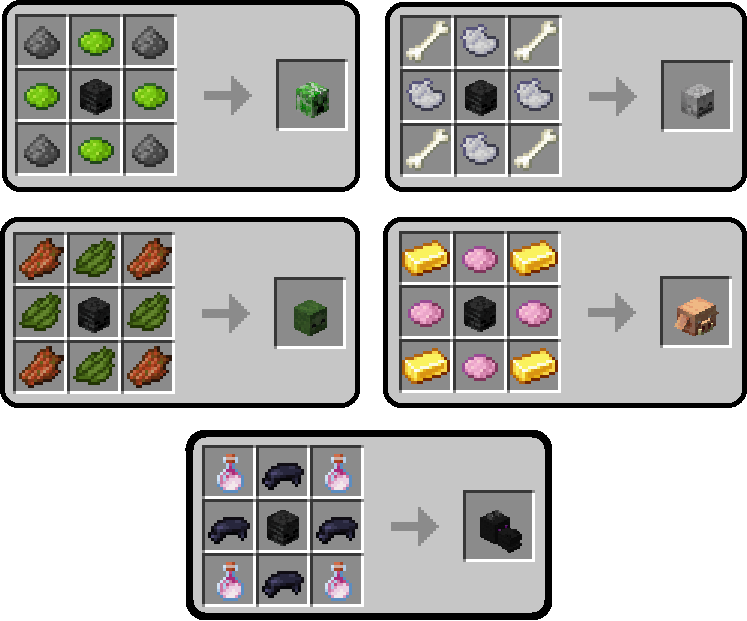

# 2BN Minecraft Custom Crafting

---

## Table of Contents

| | Crafting Tweaks | |
| :---: | --- | ---: |
| ♻️ | [**Back to Blocks**](#️-back-to-blocks) | [💾](#download-2bn-back-to-blocks) |
| 🎨 | [**Craftable Dyes**](#-craftable-dyes) | [💾](#download-2bn-craftable-dyes) |
| 🪽 | [**Craftable Elytra**](#-craftable-elytra) | [💾](#download-2bn-craftable-elytra) |
| 💿 | [**Craftable Music Discs**](#-craftable-music-discs) | [💾](#download-2bn-craftable-music-discs) |
| 🏺 | [**Craftable Pottery Sherds**](#-craftable-pottery-sherds) | [💾](#download-2bn-craftable-pottery-sherds) |
| ✨ | [**Craftable Rarities**](#-craftable-rarities) | [💾](#download-2bn-craftable-rarities) |
| 💀 | [**Craftable Skulls**](#-craftable-skulls) | [💾](#download-2bn-craftable-skulls) |
| ➕🧱 | [**More Blocks**](#-more-blocks) | [💾](#download-2bn-more-blocks) |
| ♻️🌈 | [**Universal Dyeing**](#️-universal-dyeing) | [💾](#download-2bn-universal-dyeing) |

---

## ♻️ [Back to Blocks](back-to-blocks/)

Original inspiration taken from [Vanilla Tweaks: Crafting Tweaks > QoL](https://vanillatweaks.net/picker/crafting-tweaks), and enhanced to include more reverse crafting recipes.

Instead of just allowing reverse crafting from stairs and slabs, we offer reverse crafting for all types of:

| | | | |
| :---: | :---: | :---: | :---: |
| [boats](https://minecraft.wiki/w/Boat) | [buttons](https://minecraft.wiki/w/Button) | [chest boats](https://minecraft.wiki/w/Boat_with_Chest) | [doors](https://minecraft.wiki/w/Door) |
| [fence gates](https://minecraft.wiki/w/Fence_Gate) | [fences](https://minecraft.wiki/w/Fence) | [hanging signs](https://minecraft.wiki/w/Hanging_Sign) | [pressure plates](https://minecraft.wiki/w/Pressure_Plate) |
| [quartz](https://minecraft.wiki/w/Block_of_Quartz) | [signs](https://minecraft.wiki/w/Sign) | [slabs](https://minecraft.wiki/w/Slab) | [stairs](https://minecraft.wiki/w/Stairs) |
| [trapdoors](https://minecraft.wiki/w/Trapdoor) | | | |

### Download 2BN Back to Blocks

| Version | Download (.zip) |
| --- | --- |
| 1.21.4 | [Download 💾](back-to-blocks/1.21.4/2bn-back-to-blocks/2bn-back-to-blocks_1.21.4.zip) |
| 1.21.0 | [Download 💾](back-to-blocks/1.21.0/2bn-back-to-blocks/2bn-back-to-blocks.zip) |
| 1.20.4 | [Download 💾](back-to-blocks/1.20.4/2bn-reverse-crafting-VTmodified/2bn-reverse-crafting-VTmodified.zip) |

---

## 🎨 [Craftable Dyes](craftable-dyes/)

Sometimes [dyes](https://minecraft.wiki/w/Dye) can be tough to obtain, or take forever to smelt. We've added a solution to allow easier access to the following dyes:

| Dye | Recipe | How |
| --- | --- | --- |
| black | coal / charcoal | crafting table |
| green | kelp | crafting table |

### Download 2BN Craftable Dyes

| Version | Download (.zip) |
| --- | --- |
| 1.21.4 | [Download 💾](craftable-dyes/1.21.4/2bn-craftable-dyes/2bn-craftable-dyes_1.21.4.zip) |

---

## 🪽 [Craftable Elytra](craftable-elytra/)

Some players are terrified of visiting the End dimension, and therefore have to pay other players to obtain [Elytra](https://minecraft.wiki/w/Elytra) or Shulker Boxes for them. It might take a bit longer and be rather expensive, but some may consider it far better than going to the End. Plus, for hardcore players, this means potentially having wings before defeating the dragon, Jane!

### Download 2BN Craftable Elytra

| Version | Download (.zip) |
| --- | --- |
| 1.21.0 | [Download 💾](craftable-elytra/1.21.0/2bn-craftable-elytra/2bn-craftable-elytra.zip) |
| 1.20.4 | [Download 💾](craftable-elytra/1.20.4/2bn-craftable-elytra/2bn-craftable-elytra.zip) |

---

## 💿 [Craftable Music Discs](craftable-music-discs/)

Music fans, listen up! Gone are the days where you must hunt for your favorite [music disc](https://minecraft.wiki/w/Music_Disc). Now you can craft your favorites, and twerk along to the beat!

### Download 2BN Craftable Music Discs

| Version | Download (.zip) |
| --- | --- |
| 1.21.0 | [Download 💾](craftable-music-discs/1.21.0/2bn-craftable-music-discs/2bn-craftable-music-discs.zip) |
| 1.20.4 | [Download 💾](craftable-music-discs/1.20.4/2bn-craftable-discs/2bn-craftable-discs.zip) |

---

## 🏺 [Craftable Pottery Sherds](craftable-pottery-sherds/)

Running low on your favorite pottery sherds? Now you can craft more - well, technically, triplicate them! Just combine:

- 1 sherd of your choice
- 1 terracotta
- 7 bricks

... and you'll receive 4 identical sherds in return - that's a net gain of +3!

### Download 2BN Craftable Pottery Sherds

| Version | Download (.zip) |
| --- | --- |
| 1.21.4 | [Download 💾](craftable-pottery-sherds/1.21.4/2bn-craftable-pottery-sherds/2bn-craftable-pottery-sherds_1.21.4.zip) |
| 1.21.0 | [Download 💾](craftable-pottery-sherds/1.21.0/2bn-craftable-pottery-sherds/2bn-craftable-pottery-sherds.zip) |
| 1.20.4 | [Download 💾](craftable-pottery-sherds/1.20.4/2bn-craftable-sherds/2bn-craftable-sherds.zip) |

---

## ✨ [Craftable Rarities](craftable-rarities/)

Sometimes items are quite difficult to collect, or perhaps you're trying to obtain a stack of everything as part of the [BlazeandCaves](https://docs.google.com/spreadsheets/d/1zlRBAkHZhoMlGBbLIvKGxY4wufVVpAhYko48QH6LDNs/edit?gid=0#gid=0) "super challenges". We've made it possible to craft a few of the more *difficult-to-obtain* items:

- [Disc Fragment 5](https://minecraft.wiki/w/Disc_Fragment)
- [Echo Shard](https://minecraft.wiki/w/Echo_Shard)
- [Heart of the Sea](https://minecraft.wiki/w/Heart_of_the_Sea)
- [Enchanted Golden Apple](https://minecraft.wiki/w/Enchanted_Golden_Apple)

### Download 2BN Craftable Rarities

| Version | Download (.zip) |
| --- | --- |
| 1.21.0 | [Download 💾](craftable-rarities/1.21.0/2bn-craftable-rarities/2bn-craftable-rarities.zip) |
| 1.20.4 | [Download 💾](craftable-rarities/1.20.4/2bn-craftable-rarities/2bn-craftable-rarities.zip) |

---

## 💀 [Craftable Skulls](craftable-skulls/)

Do you hate working with creepers? Especially charged creepers? So do we! Now you can use wither skulls (which are far easier to obtain) to craft your favorite [mob head](https://minecraft.wiki/w/Head).

- [Creeper Head](https://minecraft.wiki/w/Creeper_Head)
- [Skeleton Skull](https://minecraft.wiki/w/Skeleton_Skull)
- [Zombie Head](https://minecraft.wiki/w/Zombie_Head)
- [Piglin Head](https://minecraft.wiki/w/Piglin_Head)
- [Dragon Head](https://minecraft.wiki/w/Dragon_Head)

### Download 2BN Craftable Skulls

| Version | Download (.zip) |
| --- | --- |
| 1.21.0 | [Download 💾](craftable-skulls/1.21.0/2bn-craftable-skulls/2bn-craftable-skulls.zip) |
| 1.20.4 | [Download 💾](craftable-skulls/1.20.4/2bn-craftable-skulls/2bn-craftable-skulls.zip) |

---

## ➕🧱 [More Blocks](more-blocks/)

Original inspiration taken from [Vanilla Tweaks: Crafting Tweaks > QoL](https://vanillatweaks.net/picker/crafting-tweaks), and enhanced to include more blocks from other crafting types.

| Block | Vanilla | More Blocks |
| --- | :---: | :---: |
| [Trapdoors](https://minecraft.wiki/w/Trapdoor) | 3 | 12 |
| [Wood](https://minecraft.wiki/w/Wood) | 3 | 4 |
| [Hyphae](https://minecraft.wiki/w/Wood#Crimson) | 3 | 4 |
| [Stairs](https://minecraft.wiki/w/Stairs) | 4 | 8 |
| [Bricks](https://minecraft.wiki/w/Bricks) | 1 | 8 |

The difference between Vanilla Tweaks and 2BN More Blocks, is that we provide even more possibilities and variations that weren't originally considered in the VT pack.

### Download 2BN More Blocks

| Version | Download (.zip) |
| --- | --- |
| 1.21.4 | [Download 💾](more-blocks/1.21.4/2bn-more-blocks/2bn-more-blocks_1.21.4.zip) |

---

## ♻️🌈 [Universal Dyeing](universal-dyeing/)

Original inspiration taken from [Vanilla Tweaks: Crafting Tweaks > QoL](https://vanillatweaks.net/picker/crafting-tweaks), and enhanced to include even more universal dyeing options. Anything that uses dye can be found within this package.

Vanilla Tweaks only has a limited amount of universal dyeing, but we've taken it even further. Now you can re-dye any of the following:

| | | |
| :---: | :---: | :---: |
| [beds](https://minecraft.wiki/w/Bed) | [candles](https://minecraft.wiki/w/Candle) | [wools](https://minecraft.wiki/w/Wool) |
| [concrete powder](https://minecraft.wiki/w/Concrete_Powder) | [concrete](https://minecraft.wiki/w/Concrete) | |
| [terracotta](https://minecraft.wiki/w/Terracotta) | [glazed terracotta](https://minecraft.wiki/w/Glazed_Terracotta) | |
| [stained glass](https://minecraft.wiki/w/Stained_Glass) | [stained glass panes](https://minecraft.wiki/w/Stained_Glass_Pane) | |
| [red sand](https://minecraft.wiki/w/Red_Sand) | [red sandstone](https://minecraft.wiki/w/Red_Sandstone) | [smooth red sandstone](https://minecraft.wiki/w/Smooth_Red_Sandstone) |

[Ice](https://minecraft.wiki/w/Ice) can be used to remove color from items/blocks that have a natural state without dye (candle, glass, glass pane, terracotta).

### Download 2BN Universal Dyeing

| Version | Download (.zip) |
| --- | --- |
| 1.21.4 | [Download 💾](universal-dyeing/1.21.4/2bn-universal-dyeing/2bn-universal-dyeing.zip) |
| 1.21.0 | [Download 💾](universal-dyeing/1.21.0/2bn-universal-dyeing/2bn-universal-dyeing.zip) |
| 1.20.4 | [Download 💾](universal-dyeing/1.20.4/2bn-universal-dyes-VTmodified/2bn-universal-dyes-VTmodified.zip) |

---

