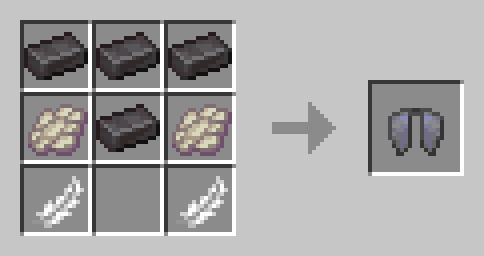
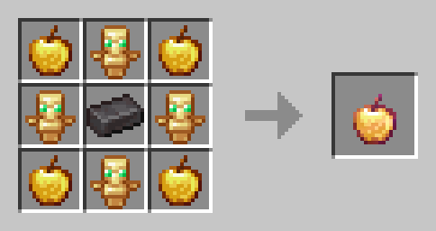
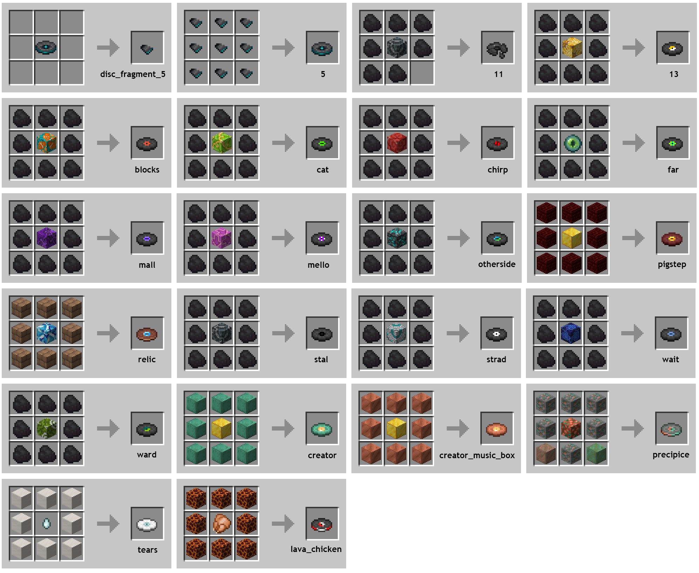
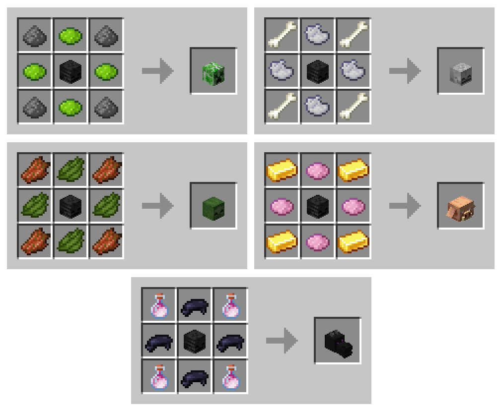

# Minecraft 2BN Tweaks

---

## Table of Contents

| | Crafting Tweaks | |
| :---: | --- | ---: |
| ♻️ | [**Back-to-Blocks**](#️-back-to-blocks) | [💾](#download) |
| 🎨 | [**Dyes**](#-dyes) | [💾](#download-1) |
| 🪞 | [**Echo Shard**](#-echo-shard) | [💾](#download-2) |
| 🪽 | [**Elytra**](#-elytra) | [💾](#download-3) |
| 🍏 | [**Enchanted Golden Apple**](#-enchanted-golden-apple) | [💾](#download-4) |
| 🌊 | [**Heart of the Sea**](#-heart-of-the-sea) | [💾](#download-5) |
| 💿 | [**Music Discs**](#-music-discs) | [💾](#download-6) |
| 🏺 | [**Pottery Sherds**](#-pottery-sherds) | [💾](#download-7) |
| 💀 | [**Skulls**](#-skulls) | [💾](#download-8) |
| ➕🧱 | [**More Blocks**](#-more-blocks) | [💾](#download-9) |
| ♻️🎨 | [**Universal Dyeing**](#️-universal-dyeing) | [💾](#download-10) |
| ⚖️ | [**License**](#️-license) | |

---

## ♻️ [Back-to-Blocks](back-to-blocks/)

A Minecraft datapack that adds hundreds of crafting recipes to reverse decorative/utility blocks back into a *lossy** base form. Go beyond slabs and stairs; reclaim any of the supported block types below.

| | | | |
| --- | --- | --- | --- |
| boats | chest boats | rafts | chest rafts |
| buttons | pressure plates | doors | trapdoors |
| signs | hanging signs | slabs | stairs |
| fences | fence gates | walls | |
| quartz | redstone components | workstations | utility blocks |
| bulbs | grates | resin | |

* Lossy base form means the original materials aren't fully recoverable; reverse-crafting comes with a deliberate loss, and is not intended to be 1:1.

**[View the full recipe list in Google Sheets](https://docs.google.com/spreadsheets/d/1t9lmXWqlyno15NTqfUDTYcuZuNVCAmxs4Pt4w9a5CPI)**

### Download

| Supported Versions | Download (.zip) |
| --- | --- |
| 1.20.0 – 1.21.7+ | 💾 [Download 2BN-Tweaks: Back-to-Blocks](back-to-blocks/2BN-Tweaks_Back-to-Blocks.zip?raw=1) |

---

## 🎨 [Dyes](craftables/dyes/)

This datapack expands your dye-making repertoire with **alternative, lore-friendly recipes** for a handful of hard-to-find or biome-dependent colors. Whether you're stuck in a snowy wasteland or just tired of chasing squids, you'll appreciate the pigmental perks below:

| Dye | Craft Options | Supports |
| --- | --- | --- |
| 🧡 Orange | Resin Clump | 1.21.4+ |
| 💚 Green | Kelp | 1.20.0+ |
| 💜 Purple | Chorus Fruit, Amethyst Shard | 1.20.0+ |
| 🖤 Black | Coal, Charcoal | 1.20.0+ |

All recipes aim to be balanced, thematic, and helpful for younger players, or just anyone who's dyeing for a better solution.

### Download

| Supported Versions | Download (.zip) |
| --- | --- |
| 1.20.0 - 1.21.7+ | 💾 [Download 2BN-Tweaks: Craftable Dyes](craftables/dyes/2BN-Tweaks_Craftable_Dyes.zip?raw=1) |

---

## 🪞 [Echo Shard](craftables/echo-shard/)

Craftable echo shards, so you can avoid looting multiple Ancient Cities *and* avoid making eye contact with the Warden. Echoes of wisdom, not screams.

Great for recovery compasses, lore builds, or just skipping the part where you get yeeted into the void by a blind shrieking deathbeast.

### Download

| Supported Versions | Download (.zip) |
| --- | --- |
| 1.20.0 – 1.21.7+ | 💾 [Download 2BN-Tweaks: Craftable Echo-Shard](craftables/echo-shard/2BN-Tweaks_Craftable_Echo-Shard.zip?raw=1) |

---

## 🪽 [Elytra](craftables/elytra/)

Soar in style - without looting End Cities like a desperate loot goblin. This datapack lets you **craft your own Elytra** using a blend of feather, phantom, and full-blown netherite.

Because let's face it: if you've already fought your way through the Nether and survived sleep deprivation long enough to farm phantom bits... you've *earned* your wings.

### Download

| Supported Versions | Download (.zip) |
| --- | --- |
| 1.20.0 – 1.21.7+ | 💾 [Download 2BN-Tweaks: Craftable Elytra](craftables/elytra/2BN-Tweaks_Craftable_Elytra.zip?raw=1) |

---

## 🍏 [Enchanted Golden Apple](craftables/enchanted-golden-apple/)

Bring back the bling! This datapack restores the ability to **craft the Enchanted Golden Apple**, using a recipe so lavish that it might bankrupt your inventory.

Yes, it's expensive. Yes, it's overkill. Yes, it's *exactly what Notch didn't want you to have*. Eat responsibly.

### Download

| Supported Versions | Download (.zip) |
| --- | --- |
| 1.20.0 – 1.21.7+ | 💾 [Download 2BN-Tweaks: Craftable Enchanted-Golden-Apple](craftables/enchanted-golden-apple/2BN-Tweaks_Craftable_Enchanted-Golden-Apple.zip?raw=1) |

---

## 🌊 [Heart of the Sea](craftables/heart-of-the-sea/)

This datapack lets you craft a **Heart of the Sea**, saving you from aimlessly looting treasure maps and dodging drowned for a single underwater bauble.

Perfect for conduit crafters, Atlantis builders, or players who just want their ocean base to look like Poseidon's summer home.

### Download

| Supported Versions | Download (.zip) |
| --- | --- |
| 1.20.0 – 1.21.7+ | 💾 [Download 2BN-Tweaks: Craftable Heart-of-the-Sea](craftables/heart-of-the-sea/2BN-Tweaks_Craftable_Heart-of-the-Sea.zip?raw=1) |

---

## 💿 [Music Discs](craftables/music-discs/)

This datapack adds shaped crafting recipes for every **music disc** and **disc fragment** - because sometimes you just want the tunes without the *kaboom*.

No more luring charged creepers toward scary mobs, or your sanity. Just craft your vibe, and drop the beat!

Perfect for jukebox collectors, mapmakers, or anyone who thinks *Pigstep* should be more accessible than a Bastion's basement.

### Download

| Supported Versions | Download (.zip) |
| --- | --- |
| 1.20.0 - 1.21.7+ | 💾 [Download 2BN-Tweaks: Craftable Music-Discs](craftables/music-discs/2BN-Tweaks_Craftable_Music-Discs.zip?raw=1) |

---

## 🏺 [Pottery Sherds](craftables/pottery-sherds/)

Triplicate those precious archaeological finds! This datapack lets you **clone pottery sherds** using bricks and terracotta. Simply combine any pottery sherd with supporting materials to get three more, so you end up with **4 total**.

Perfect for decorative builders or lore nerds who want matching sets without raiding every suspicious sand pile in a 1,000-block radius.

### Download

| Supported Versions | Download (.zip) |
| --- | --- |
| 1.20.0 – 1.21.7+ | 💾 [Download 2BN-Tweaks: Craftable Pottery-Sherds](craftables/pottery-sherds/2BN-Tweaks_Craftable_Pottery-Sherds.zip?raw=1) |

---

## 💀 [Skulls](craftables/skulls/)

This datapack adds **shaped crafting recipes** to create some iconic mob heads using dye, mob-related items, and a sacrificial *wither skeleton skull*. Great for builders, mapmakers, trophy hunters... or anyone with a flair for the dramatic.

**Note:** Recipes are intentionally expensive and lore-balanced. You're literally *reanimating skulls* here. Not exactly light work, but perhaps easier than using charged creepers, eh?

### Download

| Supported Versions | Download (.zip) |
| --- | --- |
| 1.20.0 – 1.21.7+ | 💾 [Download 2BN-Tweaks: Craftable Skulls](craftables/skulls/2BN-Tweaks_Craftable_Skulls.zip?raw=1) |

---

## ➕🧱 [More Blocks](more-blocks/)

A Minecraft datapack that enhances vanilla crafting by increasing the **yield** of many decorative and utility block recipes. No new blocks, just **more** of the ones you already craft. Get smarter returns for all supported block types below. Build big, waste less. Quantities align nicely with reverse crafting from our [Back-to-Blocks](#️-back-to-blocks) datapack.

| | Vanilla | 2BN-Tweaks |
| --- | :---: | :---: |
| bark (wood/hyphae) | 3 | 4 |
| bricks | 1 | 4 |
| pressure plates | 1 | 2 |
| stairs | 4 | 6 / 8 * |
| trapdoors | 1 | 2 / 4 / 6 ** |

* Wood = 8 / Others = 6.

** Iron = 2 / Copper = 4 / Wood = 6.

**[View the full recipe list in Google Sheets](https://docs.google.com/spreadsheets/d/1t9lmXWqlyno15NTqfUDTYcuZuNVCAmxs4Pt4w9a5CPI/edit?gid=1434501916#gid=1434501916)**

### Download

| Supported Versions | Download (.zip) |
| --- | --- |
| 1.20.0 – 1.21.7+ | 💾 [Download 2BN-Tweaks: More-Blocks](more-blocks/2BN-Tweaks_More-Blocks.zip?raw=1) |

---

## ♻️🎨 [Universal Dyeing](universal-dyeing/)

A Minecraft datapack that breaks the vanilla dye barrier. **Re-dye** or **un-dye** several types of blocks. Whether you're fixing a color mistake, or just feeling fickle, this pack lets you flex your palette.

Use **any dye** to recolor these blocks, or use **ice** to scrub them back to their non-dyed form*.

| | | |
| --- | --- | --- |
| candles* | | |
| carpets | wool | |
| concrete | concrete powder | |
| terracotta* | glazed terracotta | |
| stained glass* | stained glass panes* | |
| sand | sandstone | smooth sandstone |
| red sand* | red sandstone* | smooth red sandstone* |

* These blocks can be **un-dyed** using ice to revert them to their natural, uncolored state.

**[View the full recipe list in Google Sheets](https://docs.google.com/spreadsheets/d/1t9lmXWqlyno15NTqfUDTYcuZuNVCAmxs4Pt4w9a5CPI/edit?gid=931243409#gid=931243409)**

### Download

| Supported Versions | Download (.zip) |
| --- | --- |
| 1.20.0 – 1.21.7+ | 💾 [Download 2BN-Tweaks: Universal-Dyeing](universal-dyeing/2BN-Tweaks_Universal-Dyeing.zip?raw=1) |

---

## ⚖️ License

All `2BN-Tweaks` datapacks and their generator scripts are licensed under Creative Commons Attribution-NonCommercial-ShareAlike 4.0 International (CC BY-NC-SA 4.0).

You are free to:
- Share, adapt, remix, and use this work non-commercially
- So long as you provide attribution (*see below*)
- And license derivatives under the same terms

> 📜 **Attribution**  
> **[2BN-Tweaks](https://github.com/TravelTimN/minecraft-2bn-tweaks)**  
> Created by [TravelTimN](https://github.com/TravelTimN)  
> Licensed under [CC BY-NC-SA 4.0](https://creativecommons.org/licenses/by-nc-sa/4.0)

---
